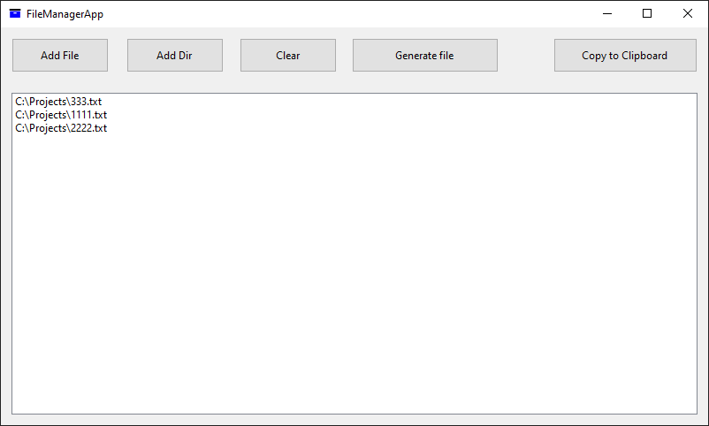

# FileManagerApp

## File Manager Application

This C# Windows Forms application is a versatile file management tool designed to streamline the process of working with multiple files and directories. The application offers a user-friendly interface with the following key features:

### Main Features

#### File and Directory Addition
- Users can add individual files or entire directories to the application.
- Supports both manual selection through dialog boxes and drag-and-drop functionality.

#### File Listing
- Displays a comprehensive list of all added files in a ListBox control.
- Automatically expands directories to include all nested files.

#### Text File Generation
- Combines the contents of all added text files into a single output file.
- Handles binary files by skipping their content and noting their presence.

#### Clipboard Integration
- Allows users to copy the contents of all added files to the system clipboard.
- Useful for quick sharing or pasting into other applications.

#### List Management
- Includes a 'Clear' function to reset the file list.

### User Interface
The application window contains:
- A ListBox displaying all added files and their paths.
- Buttons for adding files, adding directories, clearing the list, generating a text file, and copying to clipboard.
- Drag-and-drop support for the entire form and ListBox.

### Technical Details
- Developed in C# using Windows Forms.
- Utilizes .NET Framework classes for file and directory operations.
- Implements exception handling for robust file reading and writing.
- Supports UTF-8 encoding for text file operations.

### Use Cases
This application is particularly useful for:
- Combining multiple text files into a single document.
- Quickly viewing the contents of multiple files.
- Preparing file lists for further processing or documentation.
- Streamlining workflow when dealing with numerous files across different directories.

The File Manager Application offers a simple yet powerful tool for users who frequently work with multiple files and need an efficient way to manage, combine, and share their contents.